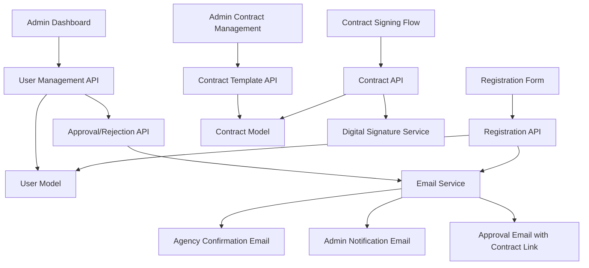

# Design Document

## Overview

The enhanced agency registration system extends the existing user registration flow with additional form fields, comprehensive email notification system, admin moderation workflow, and contract management capabilities. The design leverages the existing Next.js architecture, MongoDB data layer, and email infrastructure while adding new components and API endpoints.

## Architecture

### System Components



### Data Flow

1. **Registration Phase**: Agency submits enhanced form → System creates pending user → Sends confirmation to agency and notification to admins
2. **Moderation Phase**: Admin reviews registration → Approves/rejects → System sends approval email with contract link
3. **Contract Phase**: Agency follows link → Authenticates → Views contract → Signs → Status updated to fully onboarded
4. **Management Phase**: Admin manages contract templates and tracks agency statuses

## Components and Interfaces

### Frontend Components

#### Enhanced Registration Form
- **Location**: `src/components/auth/EnhancedRegisterForm.tsx`
- **Purpose**: Extends existing RegisterForm with company and consortia fields
- **Props**: 
  - `onSubmit: (data: EnhancedRegistrationData) => void`
  - `loading: boolean`
  - `errors: ValidationErrors`

#### Admin Agency Management Dashboard
- **Location**: `src/components/admin/AgencyManagement.tsx`
- **Purpose**: Displays pending registrations with approval/rejection actions
- **Features**: 
  - Filterable list of agencies by status
  - Detailed view of registration information
  - Approve/reject buttons with optional comments

#### Contract Signing Interface
- **Location**: `src/components/contract/ContractSigning.tsx`
- **Purpose**: Displays contract and handles digital signing
- **Features**:
  - Scrollable contract display
  - Progress tracking for reading
  - Digital signature capture or checkbox acceptance

#### Contract Template Manager
- **Location**: `src/components/admin/ContractTemplateManager.tsx`
- **Purpose**: Admin interface for managing contract templates
- **Features**:
  - Rich text editor for contract content
  - Version history display
  - Template activation controls

### API Endpoints

#### Registration Enhancement
- **Endpoint**: `POST /api/auth/register` (enhanced)
- **Purpose**: Handles registration with additional fields
- **Request Body**:
```typescript
{
  name: string;
  email: string;
  password: string;
  company: string;
  consortia?: string;
  role: 'agency';
}
```

#### Agency Moderation
- **Endpoint**: `GET /api/admin/agencies/pending`
- **Purpose**: Retrieves pending agency registrations
- **Response**: Array of pending agency objects with full details

- **Endpoint**: `POST /api/admin/agencies/{id}/approve`
- **Purpose**: Approves agency registration and triggers contract email
- **Request Body**: `{ comments?: string }`

- **Endpoint**: `POST /api/admin/agencies/{id}/reject`
- **Purpose**: Rejects agency registration
- **Request Body**: `{ reason: string }`

#### Contract Management
- **Endpoint**: `GET /api/contracts/current`
- **Purpose**: Retrieves current contract template for signing
- **Authentication**: Required (approved agency)

- **Endpoint**: `POST /api/contracts/sign`
- **Purpose**: Records contract signature
- **Request Body**: `{ signature: string | boolean, timestamp: Date }`

- **Endpoint**: `GET /api/admin/contracts/templates`
- **Purpose**: Admin endpoint for contract template management
- **Response**: Array of contract versions

- **Endpoint**: `POST /api/admin/contracts/templates`
- **Purpose**: Creates new contract template version
- **Request Body**: `{ content: string, title: string }`

## Data Models

### Enhanced User Model
```typescript
interface EnhancedUser extends User {
  company: string;
  consortia?: string;
  registrationStatus: 'pending' | 'approved' | 'rejected' | 'contracted';
  approvedAt?: Date;
  approvedBy?: ObjectId;
  rejectionReason?: string;
  contractSignedAt?: Date;
  contractVersion?: string;
}
```

### Contract Template Model
```typescript
interface ContractTemplate {
  _id: ObjectId;
  version: string;
  title: string;
  content: string;
  isActive: boolean;
  createdAt: Date;
  createdBy: ObjectId;
  effectiveDate: Date;
}
```

### Contract Signature Model
```typescript
interface ContractSignature {
  _id: ObjectId;
  userId: ObjectId;
  contractTemplateId: ObjectId;
  signedAt: Date;
  signature: string; // Digital signature data or acceptance confirmation
  ipAddress: string;
  userAgent: string;
}
```

## Error Handling

### Registration Errors
- **Validation Errors**: Client-side validation for required fields, server-side validation for data integrity
- **Email Delivery Failures**: Retry mechanism with exponential backoff, admin notification for persistent failures
- **Database Errors**: Transaction rollback for registration process, user-friendly error messages

### Contract Signing Errors
- **Authentication Failures**: Redirect to login with return URL to contract
- **Template Loading Errors**: Fallback to previous version, admin notification
- **Signature Capture Errors**: Multiple signature methods (digital signature, checkbox acceptance)

### Admin Interface Errors
- **Permission Errors**: Role-based access control validation
- **Bulk Operation Errors**: Partial success handling with detailed error reporting
- **Template Update Errors**: Version conflict resolution, automatic backup creation

## Testing Strategy

### Unit Tests
- **Form Validation**: Test enhanced registration form validation logic
- **Email Service**: Mock email delivery and test notification content
- **Contract Logic**: Test contract template versioning and signature validation
- **API Endpoints**: Test all new endpoints with various input scenarios

### Integration Tests
- **Registration Flow**: End-to-end test from form submission to admin notification
- **Approval Workflow**: Test admin approval triggering contract email
- **Contract Signing**: Test complete contract signing flow with authentication
- **Email Delivery**: Test actual email delivery in staging environment

### E2E Tests
- **Complete Agency Onboarding**: Test entire flow from registration to contract signing
- **Admin Moderation**: Test admin workflow for approving/rejecting agencies
- **Contract Management**: Test admin contract template management
- **Error Scenarios**: Test error handling and recovery mechanisms

## Security Considerations

### Authentication & Authorization
- **Contract Access**: Secure token-based access to contract signing interface
- **Admin Functions**: Role-based access control for moderation and contract management
- **Email Links**: Time-limited, single-use tokens for contract access

### Data Protection
- **Personal Information**: Encryption of sensitive agency data
- **Contract Content**: Version control and audit trail for contract changes
- **Digital Signatures**: Secure storage and validation of signature data

### Email Security
- **Template Injection**: Sanitization of dynamic content in email templates
- **Link Security**: HTTPS enforcement and token validation for email links
- **Rate Limiting**: Protection against email spam through registration abuse