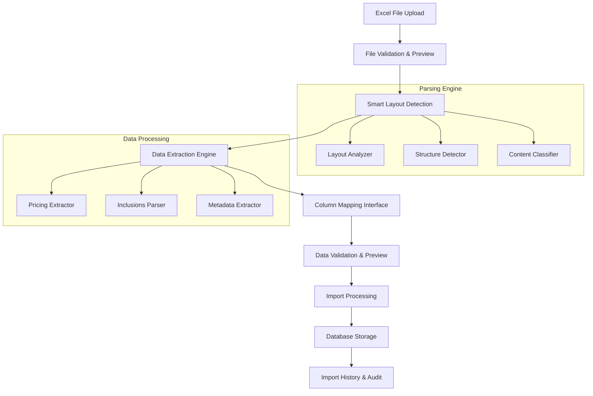

# Design Document

## Overview

The Enhanced Offers Excel Upload system will provide a sophisticated Excel parsing and import mechanism specifically designed for resort pricing data. The system will intelligently detect various Excel layouts, extract complex pricing structures with multiple dimensions (months, nights, pax, accommodation types), and handle package inclusions. The design focuses on flexibility, accuracy, and user-friendly error handling.

## Architecture

### High-Level Architecture



### System Components

1. **Excel Processing Layer**: Handles file upload, validation, and initial parsing
2. **Smart Detection Engine**: Analyzes Excel structure and content patterns
3. **Data Extraction Engine**: Extracts structured data from various Excel layouts
4. **Validation & Mapping Layer**: Validates data and handles column mapping
5. **Import Processing Layer**: Manages database operations and conflict resolution
6. **Audit & History Layer**: Tracks changes and provides rollback capabilities

## Components and Interfaces

### 1. Enhanced Excel Parser (`src/lib/enhanced-excel-parser.ts`)

```typescript
interface ResortExcelStructure {
  resortName: string;
  sheetLayout: 'months-rows' | 'months-columns' | 'mixed';
  pricingSection: {
    startRow: number;
    endRow: number;
    accommodationTypes: string[];
    nightsOptions: number[];
    paxOptions: number[];
  };
  inclusionsSection: {
    startRow: number;
    endRow: number;
    content: string[];
  };
  metadata: {
    currency: string;
    season: string;
    validFrom: Date;
    validTo: Date;
  };
}

interface ExtractedPricingData {
  month: string;
  accommodationType: string;
  nights: number;
  pax: number;
  price: number;
  currency: string;
  isAvailable: boolean;
}

interface ParsedResortData {
  resortName: string;
  destination: string;
  description: string;
  pricing: ExtractedPricingData[];
  inclusions: string[];
  exclusions?: string[];
  metadata: ResortMetadata;
  validationErrors: string[];
  warnings: string[];
}
```

### 2. Smart Layout Detector (`src/lib/excel-layout-detector.ts`)

```typescript
interface LayoutPattern {
  type: 'months-rows' | 'months-columns' | 'pricing-matrix' | 'inclusions-list';
  confidence: number;
  startCell: string;
  endCell: string;
  headers: string[];
  dataPattern: string;
}

interface DetectionResult {
  primaryLayout: LayoutPattern;
  secondaryLayouts: LayoutPattern[];
  suggestions: string[];
  confidence: number;
}

class ExcelLayoutDetector {
  detectLayout(worksheet: XLSX.WorkSheet): DetectionResult;
  findPricingSection(worksheet: XLSX.WorkSheet): PricingSection;
  findInclusionsSection(worksheet: XLSX.WorkSheet): InclusionsSection;
  extractMetadata(worksheet: XLSX.WorkSheet): ResortMetadata;
}
```

### 3. Pricing Data Extractor (`src/lib/pricing-extractor.ts`)

```typescript
interface PricingMatrix {
  months: string[];
  accommodationTypes: AccommodationType[];
  nightsOptions: number[];
  paxOptions: number[];
  priceGrid: PriceCell[][];
}

interface PriceCell {
  value: number;
  currency: string;
  isAvailable: boolean;
  notes?: string;
  validFrom?: Date;
  validTo?: Date;
}

class PricingExtractor {
  extractPricingMatrix(worksheet: XLSX.WorkSheet, layout: LayoutPattern): PricingMatrix;
  normalizePricing(matrix: PricingMatrix): ExtractedPricingData[];
  handleMergedCells(worksheet: XLSX.WorkSheet, range: string): PriceCell[];
  detectCurrency(worksheet: XLSX.WorkSheet): string;
}
```

### 4. Enhanced Offer Model

```typescript
// Extended Offer model to support flexible pricing structures
interface IFlexiblePricing {
  month: string;
  accommodationType: string;
  nights: number;
  pax: number;
  price: number;
  currency: string;
  isAvailable: boolean;
  specialPeriod?: string; // e.g., "Easter", "Peak Season"
  validFrom?: Date;
  validTo?: Date;
  notes?: string;
}

interface IEnhancedOffer extends Document {
  title: string;
  description: string;
  destination: string;
  resortName: string;
  inclusions: string[];
  exclusions?: string[];
  flexiblePricing: IFlexiblePricing[];
  metadata: {
    currency: string;
    season: string;
    lastUpdated: Date;
    importSource: string;
    version: number;
  };
  isActive: boolean;
  createdAt: Date;
  updatedAt: Date;
  createdBy: mongoose.Types.ObjectId;
}
```

### 5. Column Mapping System (`src/lib/column-mapper.ts`)

```typescript
interface ColumnMapping {
  excelColumn: string;
  systemField: string;
  dataType: 'string' | 'number' | 'date' | 'currency' | 'list';
  required: boolean;
  validator?: (value: any) => boolean;
  transformer?: (value: any) => any;
}

interface MappingTemplate {
  name: string;
  description: string;
  mappings: ColumnMapping[];
  applicablePatterns: string[];
}

class ColumnMapper {
  suggestMappings(headers: string[]): ColumnMapping[];
  saveMappingTemplate(template: MappingTemplate): void;
  loadMappingTemplates(): MappingTemplate[];
  applyMapping(data: any[], mappings: ColumnMapping[]): any[];
}
```

### 6. Import Processing Engine (`src/lib/import-processor.ts`)

```typescript
interface ImportOptions {
  conflictResolution: 'merge' | 'replace' | 'skip';
  validatePricing: boolean;
  preserveHistory: boolean;
  dryRun: boolean;
}

interface ImportResult {
  summary: {
    totalProcessed: number;
    created: number;
    updated: number;
    skipped: number;
    failed: number;
  };
  details: ImportDetail[];
  errors: ImportError[];
  warnings: string[];
  rollbackId?: string;
}

class ImportProcessor {
  processImport(data: ParsedResortData[], options: ImportOptions): Promise<ImportResult>;
  handleConflicts(existing: IEnhancedOffer, incoming: ParsedResortData): Promise<IEnhancedOffer>;
  validateBusinessRules(offer: ParsedResortData): ValidationResult;
  createRollbackPoint(importId: string): Promise<string>;
}
```

## Data Models

### Enhanced Pricing Schema

```typescript
const FlexiblePricingSchema = new Schema({
  month: {
    type: String,
    required: true,
    enum: [
      'January', 'February', 'March', 'April', 'May', 'June',
      'July', 'August', 'September', 'October', 'November', 'December',
      'Easter (18–21 Apr)', 'Peak Season', 'Off Season'
    ]
  },
  accommodationType: {
    type: String,
    required: true,
    enum: ['Hotel', 'Self-Catering', 'Apartment', 'Villa', 'Hostel', 'Resort']
  },
  nights: {
    type: Number,
    required: true,
    min: 1,
    max: 14
  },
  pax: {
    type: Number,
    required: true,
    min: 1,
    max: 20
  },
  price: {
    type: Number,
    required: true,
    min: 0
  },
  currency: {
    type: String,
    required: true,
    enum: ['EUR', 'GBP', 'USD'],
    default: 'EUR'
  },
  isAvailable: {
    type: Boolean,
    default: true
  },
  specialPeriod: String,
  validFrom: Date,
  validTo: Date,
  notes: String
});
```

### Import History Schema

```typescript
const ImportHistorySchema = new Schema({
  importId: {
    type: String,
    required: true,
    unique: true
  },
  filename: String,
  fileSize: Number,
  importedBy: {
    type: Schema.Types.ObjectId,
    ref: 'User',
    required: true
  },
  importedAt: {
    type: Date,
    default: Date.now
  },
  status: {
    type: String,
    enum: ['pending', 'completed', 'failed', 'rolled-back'],
    default: 'pending'
  },
  summary: {
    totalProcessed: Number,
    created: Number,
    updated: Number,
    failed: Number
  },
  affectedOffers: [{
    offerId: Schema.Types.ObjectId,
    action: String, // 'created', 'updated', 'failed'
    changes: Schema.Types.Mixed
  }],
  errors: [String],
  warnings: [String],
  rollbackData: Schema.Types.Mixed
});
```

## Error Handling

### Error Classification System

```typescript
enum ErrorSeverity {
  INFO = 'info',
  WARNING = 'warning',
  ERROR = 'error',
  CRITICAL = 'critical'
}

interface ProcessingError {
  severity: ErrorSeverity;
  code: string;
  message: string;
  location?: {
    sheet?: string;
    row?: number;
    column?: string;
    cell?: string;
  };
  suggestion?: string;
  recoverable: boolean;
}

class ErrorHandler {
  categorizeError(error: any): ProcessingError;
  generateSuggestions(error: ProcessingError): string[];
  isRecoverable(error: ProcessingError): boolean;
  formatUserMessage(errors: ProcessingError[]): string;
}
```

### Validation Rules

1. **Pricing Validation**:
   - Prices must be positive numbers
   - Currency must be consistent within a file
   - Date ranges must be logical
   - Pax counts must be reasonable (1-20)

2. **Structure Validation**:
   - Required sections must be present
   - Headers must be recognizable
   - Data types must match expectations
   - No circular references in merged cells

3. **Business Rules**:
   - No overlapping date ranges for same accommodation/pax combination
   - Inclusions must be meaningful (not empty or placeholder text)
   - Resort names must be consistent
   - Pricing must be complete for all advertised combinations

## Testing Strategy

### Unit Testing

1. **Excel Parser Tests**:
   - Test various Excel layouts and formats
   - Test edge cases (merged cells, empty rows, special characters)
   - Test error conditions (corrupted files, unsupported formats)

2. **Data Extraction Tests**:
   - Test pricing matrix extraction accuracy
   - Test inclusions parsing with various formats
   - Test metadata extraction from different locations

3. **Validation Tests**:
   - Test business rule validation
   - Test data type validation
   - Test constraint validation

### Integration Testing

1. **End-to-End Import Tests**:
   - Test complete import workflow with sample files
   - Test conflict resolution scenarios
   - Test rollback functionality

2. **Database Integration Tests**:
   - Test offer creation and updates
   - Test import history tracking
   - Test performance with large datasets

### Performance Testing

1. **Large File Handling**:
   - Test with Excel files containing 1000+ rows
   - Test memory usage during processing
   - Test processing time benchmarks

2. **Concurrent Import Testing**:
   - Test multiple simultaneous imports
   - Test database connection pooling
   - Test resource cleanup

### User Acceptance Testing

1. **Admin Workflow Tests**:
   - Test file upload and preview functionality
   - Test column mapping interface usability
   - Test error message clarity and actionability

2. **Real Data Tests**:
   - Test with actual supplier Excel files
   - Test with various Excel versions and formats
   - Test with different regional settings (date formats, number formats)

## Implementation Phases

### Phase 1: Core Infrastructure
- Enhanced Excel parser with smart detection
- Basic pricing extraction for standard layouts
- Improved error handling and validation

### Phase 2: Advanced Features
- Column mapping interface
- Complex layout detection (merged cells, multiple sections)
- Inclusions parsing and structuring

### Phase 3: User Experience
- Preview and validation interface
- Import history and rollback functionality
- Performance optimizations

### Phase 4: Production Readiness
- Comprehensive testing and bug fixes
- Documentation and user guides
- Monitoring and logging improvements