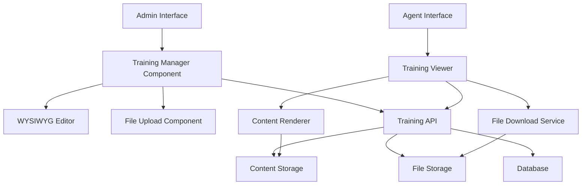

# Enhanced Training Management Design

## Overview

This design document outlines the technical approach for enhancing the existing training management system with WYSIWYG content editing capabilities and file upload functionality. The solution maintains backward compatibility while introducing modern content creation tools and secure file management.

The enhancement focuses on two key areas:
1. **Rich Content Creation**: Replacing URL-based blog/content with an integrated WYSIWYG editor
2. **File Upload System**: Replacing URL-based downloads with actual file uploads and secure serving

## Architecture

### High-Level Architecture



### Component Architecture

The system will be built using a modular approach with the following key components:

1. **Enhanced TrainingManager Component**: Updated React component with dynamic form rendering
2. **WYSIWYG Editor Integration**: Rich text editor with image upload capabilities
3. **File Upload Service**: Secure file handling with validation and storage
4. **Content Renderer**: Display component for rich content and file downloads
5. **File Management API**: Backend services for file operations
6. **Storage Layer**: File system and database storage with security

## Components and Interfaces

### Frontend Components

#### Enhanced TrainingManager Component
```typescript
interface EnhancedTrainingManagerProps {
  className?: string;
}

interface TrainingMaterialFormData {
  title: string;
  description: string;
  type: 'video' | 'blog' | 'download';
  contentUrl?: string;        // For video type
  richContent?: string;       // For blog type (HTML content)
  uploadedFiles?: File[];     // For download type
  existingFileIds?: string[]; // For editing existing downloads
  isActive: boolean;
}
```

#### WYSIWYG Editor Component
```typescript
interface WYSIWYGEditorProps {
  value: string;
  onChange: (content: string) => void;
  placeholder?: string;
  height?: number;
  imageUploadHandler?: (file: File) => Promise<string>;
}
```

#### File Upload Component
```typescript
interface FileUploadProps {
  acceptedTypes: string[];
  maxFileSize: number;
  maxFiles: number;
  onFilesChange: (files: File[]) => void;
  existingFiles?: UploadedFile[];
  onRemoveExisting?: (fileId: string) => void;
}

interface UploadedFile {
  id: string;
  name: string;
  size: number;
  type: string;
  url: string;
  uploadedAt: Date;
}
```

#### Content Renderer Component
```typescript
interface ContentRendererProps {
  material: TrainingMaterial;
  isPreview?: boolean;
}
```

### Backend Interfaces

#### Enhanced Training Material Model
```typescript
interface IEnhancedTrainingMaterial extends Document {
  title: string;
  description: string;
  type: 'video' | 'blog' | 'download';
  
  // Video content (unchanged)
  contentUrl?: string;
  
  // Rich content for blog materials
  richContent?: string;
  richContentImages?: string[]; // Array of image file IDs
  
  // File uploads for download materials
  uploadedFiles?: {
    id: string;
    originalName: string;
    fileName: string;
    filePath: string;
    mimeType: string;
    size: number;
    uploadedAt: Date;
  }[];
  
  // Legacy support
  fileUrl?: string; // Deprecated, for backward compatibility
  
  isActive: boolean;
  createdAt: Date;
  updatedAt: Date;
  createdBy: mongoose.Types.ObjectId;
}
```

#### File Management Service
```typescript
interface FileUploadResult {
  id: string;
  fileName: string;
  originalName: string;
  size: number;
  mimeType: string;
  url: string;
}

interface FileManagerService {
  uploadFile(file: Buffer, originalName: string, mimeType: string): Promise<FileUploadResult>;
  deleteFile(fileId: string): Promise<void>;
  getFileUrl(fileId: string): string;
  validateFile(file: Buffer, mimeType: string): Promise<boolean>;
}
```

## Data Models

### Enhanced TrainingMaterial Schema

```typescript
const EnhancedTrainingMaterialSchema = new Schema({
  title: { type: String, required: true, maxlength: 200 },
  description: { type: String, required: true, maxlength: 1000 },
  type: { 
    type: String, 
    required: true, 
    enum: ['video', 'blog', 'download'] 
  },
  
  // Video content (unchanged)
  contentUrl: { 
    type: String,
    validate: {
      validator: function(url: string) {
        return this.type !== 'video' || (url && isValidUrl(url));
      }
    }
  },
  
  // Rich content for blog materials
  richContent: {
    type: String,
    validate: {
      validator: function(content: string) {
        return this.type !== 'blog' || (content && content.length > 0);
      }
    }
  },
  richContentImages: [{ type: String }], // File IDs for embedded images
  
  // File uploads for download materials
  uploadedFiles: [{
    id: { type: String, required: true },
    originalName: { type: String, required: true },
    fileName: { type: String, required: true },
    filePath: { type: String, required: true },
    mimeType: { type: String, required: true },
    size: { type: Number, required: true },
    uploadedAt: { type: Date, default: Date.now }
  }],
  
  // Legacy support (deprecated)
  fileUrl: { type: String }, // For backward compatibility
  
  isActive: { type: Boolean, default: true },
  createdBy: { type: Schema.Types.ObjectId, ref: 'User', required: true }
}, { timestamps: true });
```

### File Storage Schema

```typescript
const FileStorageSchema = new Schema({
  id: { type: String, required: true, unique: true },
  originalName: { type: String, required: true },
  fileName: { type: String, required: true },
  filePath: { type: String, required: true },
  mimeType: { type: String, required: true },
  size: { type: Number, required: true },
  uploadedBy: { type: Schema.Types.ObjectId, ref: 'User', required: true },
  associatedMaterial: { type: Schema.Types.ObjectId, ref: 'TrainingMaterial' },
  isOrphaned: { type: Boolean, default: false },
  createdAt: { type: Date, default: Date.now }
});
```

## Error Handling

### File Upload Error Handling

```typescript
enum FileUploadError {
  FILE_TOO_LARGE = 'FILE_TOO_LARGE',
  INVALID_FILE_TYPE = 'INVALID_FILE_TYPE',
  MALICIOUS_CONTENT = 'MALICIOUS_CONTENT',
  STORAGE_FULL = 'STORAGE_FULL',
  UPLOAD_FAILED = 'UPLOAD_FAILED'
}

interface FileUploadErrorResponse {
  success: false;
  error: {
    code: FileUploadError;
    message: string;
    details?: any;
  };
}
```

### Content Validation Error Handling

```typescript
enum ContentValidationError {
  INVALID_HTML = 'INVALID_HTML',
  CONTENT_TOO_LARGE = 'CONTENT_TOO_LARGE',
  MISSING_REQUIRED_CONTENT = 'MISSING_REQUIRED_CONTENT',
  INVALID_IMAGE_REFERENCES = 'INVALID_IMAGE_REFERENCES'
}
```

## Testing Strategy

### Unit Testing

1. **Component Testing**
   - WYSIWYG Editor component functionality
   - File Upload component validation and UI
   - Content Renderer component display logic
   - Form validation and submission

2. **Service Testing**
   - File upload and validation services
   - Content sanitization and processing
   - Database operations and migrations
   - File storage and retrieval operations

3. **Model Testing**
   - Enhanced TrainingMaterial model validation
   - File Storage model operations
   - Migration scripts for existing data

### Integration Testing

1. **API Testing**
   - Training material CRUD operations with new fields
   - File upload and download endpoints
   - Content rendering and serving
   - Authentication and authorization

2. **File System Testing**
   - File upload and storage workflows
   - File deletion and cleanup processes
   - Storage limit and quota management
   - Security and access control

3. **Database Testing**
   - Data migration from old to new schema
   - Backward compatibility with existing materials
   - Performance with large content and files
   - Referential integrity between materials and files

### End-to-End Testing

1. **Admin Workflow Testing**
   - Create video material (existing functionality)
   - Create blog material with WYSIWYG editor
   - Create download material with file uploads
   - Edit existing materials with new features
   - Migration of legacy materials

2. **Agent Access Testing**
   - View video materials (unchanged)
   - View rich content blog materials
   - Download files from download materials
   - Access control and permissions

3. **Performance Testing**
   - Large file upload handling
   - Rich content rendering performance
   - Concurrent file access
   - Storage and bandwidth usage

## Implementation Approach

### Phase 1: Backend Infrastructure
1. Enhance TrainingMaterial model with new fields
2. Implement file upload and storage services
3. Create file management API endpoints
4. Add content sanitization and validation
5. Implement database migration scripts

### Phase 2: Frontend Components
1. Create WYSIWYG editor integration
2. Build file upload component with validation
3. Enhance TrainingManager with dynamic forms
4. Create content renderer for rich content
5. Add file download functionality

### Phase 3: Integration and Migration
1. Integrate new components with existing system
2. Implement backward compatibility layer
3. Create migration tools for existing content
4. Add comprehensive error handling
5. Implement security measures

### Phase 4: Testing and Optimization
1. Comprehensive testing across all scenarios
2. Performance optimization for file handling
3. Security audit and penetration testing
4. User acceptance testing with admin users
5. Documentation and training materials

## Security Considerations

### File Upload Security
- File type validation using MIME type and file signature
- Virus scanning for uploaded files
- File size limits and storage quotas
- Secure file naming to prevent path traversal
- Content-Type header validation for serving files

### Content Security
- HTML sanitization for rich content to prevent XSS
- Image upload validation and processing
- Content size limits to prevent DoS attacks
- Input validation and encoding

### Access Control
- Admin-only access to file upload and management
- Secure file serving with proper authentication
- File access logging and monitoring
- Orphaned file cleanup processes

## Performance Considerations

### File Handling
- Chunked file uploads for large files
- Lazy loading of file lists and previews
- CDN integration for file serving
- File compression and optimization
- Caching strategies for frequently accessed files

### Content Rendering
- HTML content caching and optimization
- Image lazy loading and responsive sizing
- Content delivery optimization
- Database query optimization for complex materials

### Storage Management
- Automated cleanup of orphaned files
- Storage usage monitoring and alerts
- File archiving strategies for old materials
- Backup and recovery procedures