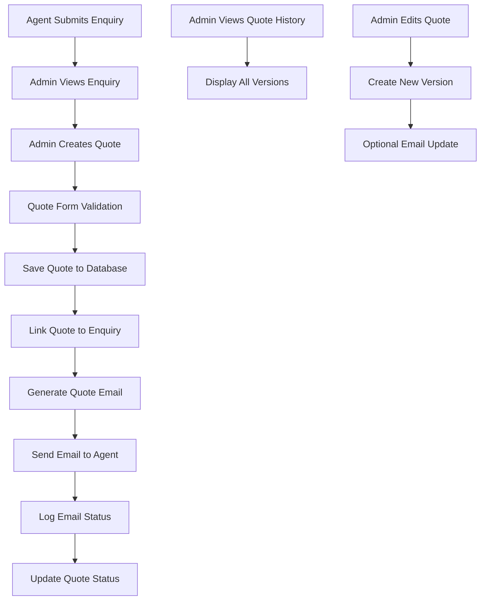

# Design Document

## Overview

The Enquiry Quoting System extends the existing enquiry management functionality by enabling administrators to create, manage, and send professional quotes in response to customer enquiries. The system integrates seamlessly with the current enquiry workflow, providing a comprehensive quote creation interface, automated email delivery, and quote tracking capabilities.

## Architecture

### System Integration Points

The quoting system integrates with several existing components:

- **Enquiry System**: Extends the current enquiry model and management interface
- **Email System**: Leverages existing email infrastructure with new quote-specific templates
- **Admin Dashboard**: Adds quote management capabilities to the existing admin interface
- **Database**: Extends the MongoDB schema with a new Quote collection

### Data Flow



## Components and Interfaces

### 1. Database Models

#### Quote Model (`src/models/Quote.ts`)

```typescript
interface IQuote extends Document {
  // Reference to original enquiry
  enquiryId: mongoose.Types.ObjectId;
  
  // Quote details
  leadName: string;
  hotelName: string;
  numberOfPeople: number;
  numberOfRooms: number;
  numberOfNights: number;
  arrivalDate: Date;
  isSuperPackage: boolean;
  whatsIncluded: string;
  transferIncluded: boolean;
  activitiesIncluded: string;
  totalPrice: number;
  currency: string; // Default: 'GBP'
  
  // Quote metadata
  version: number; // For version history
  status: 'draft' | 'sent' | 'updated';
  createdBy: mongoose.Types.ObjectId; // Admin who created
  createdAt: Date;
  updatedAt: Date;
  
  // Email tracking
  emailSent: boolean;
  emailSentAt?: Date;
  emailDeliveryStatus?: 'pending' | 'delivered' | 'failed';
  emailMessageId?: string;
}
```

#### Enhanced Enquiry Model

Extend the existing enquiry model to include quote references:

```typescript
// Add to existing IEnquiry interface
quotes: mongoose.Types.ObjectId[]; // References to Quote documents
hasQuotes: boolean; // Computed field for quick filtering
latestQuoteDate?: Date; // For sorting and display
```

### 2. API Endpoints

#### Quote Management APIs

- `POST /api/admin/quotes` - Create new quote
- `GET /api/admin/quotes` - List all quotes with filtering
- `GET /api/admin/quotes/[id]` - Get specific quote
- `PUT /api/admin/quotes/[id]` - Update existing quote
- `DELETE /api/admin/quotes/[id]` - Delete quote (soft delete)
- `POST /api/admin/quotes/[id]/send` - Send/resend quote email
- `GET /api/admin/enquiries/[id]/quotes` - Get quotes for specific enquiry

#### Email Tracking APIs

- `GET /api/admin/quotes/[id]/email-status` - Check email delivery status
- `POST /api/admin/quotes/[id]/email-retry` - Retry failed email delivery

### 3. React Components

#### QuoteManager Component (`src/components/admin/QuoteManager.tsx`)

Main component for quote management with the following features:
- Quote creation form
- Quote listing and filtering
- Quote editing capabilities
- Email status tracking
- Version history display

#### QuoteForm Component (`src/components/admin/QuoteForm.tsx`)

Dedicated form component for quote creation/editing:
- Form validation using react-hook-form and zod
- Auto-save functionality
- Pre-population from enquiry data
- Currency formatting
- Date picker integration

#### QuoteEmailPreview Component (`src/components/admin/QuoteEmailPreview.tsx`)

Preview component for quote emails:
- Real-time email template preview
- Responsive design preview
- Send test email functionality

#### Enhanced EnquiriesManager Component

Extend the existing component to include:
- "Create Quote" button for each enquiry
- Quote status indicators
- Quick quote summary display

### 4. Email Templates

#### Quote Email Template

Professional branded email template with:
- Company branding and styling
- Comprehensive quote details table
- Clear pricing breakdown
- Prominent "I'd like to book" CTA button
- Contact information and next steps
- Mobile-responsive design

Template structure:
```html
- Header with Infinity Weekends branding
- Personalized greeting
- Quote summary table
- Detailed inclusions section
- Pricing breakdown
- Call-to-action section
- Contact information
- Footer with legal/company info
```

## Data Models

### Quote Schema Design

```javascript
const QuoteSchema = new Schema({
  enquiryId: {
    type: Schema.Types.ObjectId,
    ref: 'Enquiry',
    required: true,
    index: true
  },
  
  // Lead Information
  leadName: {
    type: String,
    required: true,
    trim: true,
    maxlength: 100
  },
  
  // Accommodation Details
  hotelName: {
    type: String,
    required: true,
    trim: true,
    maxlength: 200
  },
  
  numberOfPeople: {
    type: Number,
    required: true,
    min: 1,
    max: 100
  },
  
  numberOfRooms: {
    type: Number,
    required: true,
    min: 1,
    max: 50
  },
  
  numberOfNights: {
    type: Number,
    required: true,
    min: 1,
    max: 30
  },
  
  arrivalDate: {
    type: Date,
    required: true,
    validate: {
      validator: function(date) {
        return date > new Date();
      },
      message: 'Arrival date must be in the future'
    }
  },
  
  // Package Details
  isSuperPackage: {
    type: Boolean,
    default: false
  },
  
  whatsIncluded: {
    type: String,
    required: true,
    maxlength: 2000
  },
  
  transferIncluded: {
    type: Boolean,
    default: false
  },
  
  activitiesIncluded: {
    type: String,
    maxlength: 1000
  },
  
  // Pricing
  totalPrice: {
    type: Number,
    required: true,
    min: 0,
    max: 1000000
  },
  
  currency: {
    type: String,
    default: 'GBP',
    enum: ['GBP', 'EUR', 'USD']
  },
  
  // Version Control
  version: {
    type: Number,
    default: 1
  },
  
  status: {
    type: String,
    enum: ['draft', 'sent', 'updated'],
    default: 'draft'
  },
  
  // Audit Trail
  createdBy: {
    type: Schema.Types.ObjectId,
    ref: 'User',
    required: true
  },
  
  // Email Tracking
  emailSent: {
    type: Boolean,
    default: false
  },
  
  emailSentAt: Date,
  
  emailDeliveryStatus: {
    type: String,
    enum: ['pending', 'delivered', 'failed'],
    default: 'pending'
  },
  
  emailMessageId: String,
  
  // Notes and Comments
  internalNotes: {
    type: String,
    maxlength: 1000
  }
}, {
  timestamps: true
});

// Indexes for performance
QuoteSchema.index({ enquiryId: 1, version: -1 });
QuoteSchema.index({ createdBy: 1, createdAt: -1 });
QuoteSchema.index({ status: 1, createdAt: -1 });
QuoteSchema.index({ emailDeliveryStatus: 1 });
```

### Enhanced Enquiry Schema

Add quote-related fields to the existing enquiry schema:

```javascript
// Add to existing EnquirySchema
quotes: [{
  type: Schema.Types.ObjectId,
  ref: 'Quote'
}],

hasQuotes: {
  type: Boolean,
  default: false
},

latestQuoteDate: Date,

quotesCount: {
  type: Number,
  default: 0
}
```

## Error Handling

### Validation Rules

1. **Quote Form Validation**:
   - All required fields must be present
   - Dates must be in the future
   - Numeric fields must be within valid ranges
   - Text fields must not exceed maximum lengths

2. **Business Logic Validation**:
   - Cannot create quote for non-existent enquiry
   - Only approved admins can create quotes
   - Email addresses must be valid format

3. **Email Delivery Handling**:
   - Retry mechanism for failed email delivery
   - Fallback notification to admin if email fails
   - Graceful degradation if email service is unavailable

### Error Response Format

```typescript
interface ErrorResponse {
  success: false;
  error: {
    code: string;
    message: string;
    details?: any;
  };
}
```

Common error codes:
- `VALIDATION_ERROR`: Form validation failed
- `ENQUIRY_NOT_FOUND`: Referenced enquiry doesn't exist
- `UNAUTHORIZED`: User lacks required permissions
- `EMAIL_DELIVERY_FAILED`: Quote email could not be sent
- `INTERNAL_ERROR`: Unexpected server error

## Testing Strategy

### Unit Tests

1. **Model Tests**:
   - Quote model validation
   - Schema constraints
   - Virtual fields and methods

2. **API Tests**:
   - Quote CRUD operations
   - Authentication and authorization
   - Input validation
   - Error handling

3. **Component Tests**:
   - Form validation and submission
   - Email preview rendering
   - Quote listing and filtering

### Integration Tests

1. **Email Integration**:
   - Quote email generation
   - Email delivery tracking
   - Template rendering

2. **Database Integration**:
   - Quote-enquiry relationships
   - Version history management
   - Data consistency

### End-to-End Tests

1. **Complete Quote Workflow**:
   - Admin creates quote from enquiry
   - Email is sent to agent
   - Quote appears in enquiry history

2. **Quote Management**:
   - Edit existing quote
   - Version history tracking
   - Email resending

## Security Considerations

### Authentication & Authorization

- Only authenticated admin users can access quote functionality
- Role-based access control for quote operations
- Audit logging for all quote-related actions

### Data Protection

- Sensitive quote information is protected
- Email templates sanitize user input
- Database queries use parameterized statements

### Email Security

- Email templates prevent XSS attacks
- Secure email delivery with authentication
- Email tracking without exposing sensitive data

## Performance Considerations

### Database Optimization

- Proper indexing on frequently queried fields
- Efficient pagination for quote listings
- Optimized queries for enquiry-quote relationships

### Caching Strategy

- Cache email templates for faster rendering
- Cache quote statistics for dashboard display
- Implement query result caching where appropriate

### Email Performance

- Asynchronous email sending to avoid blocking
- Email queue for handling high volumes
- Retry mechanism with exponential backoff

## Deployment Considerations

### Environment Variables

New environment variables required:
- Email template configuration
- Quote-specific settings
- Currency formatting options

### Database Migration

Migration script to:
- Create Quote collection
- Add quote fields to Enquiry collection
- Create necessary indexes
- Set up initial data if needed

### Monitoring

- Email delivery success rates
- Quote creation and conversion metrics
- System performance monitoring
- Error rate tracking