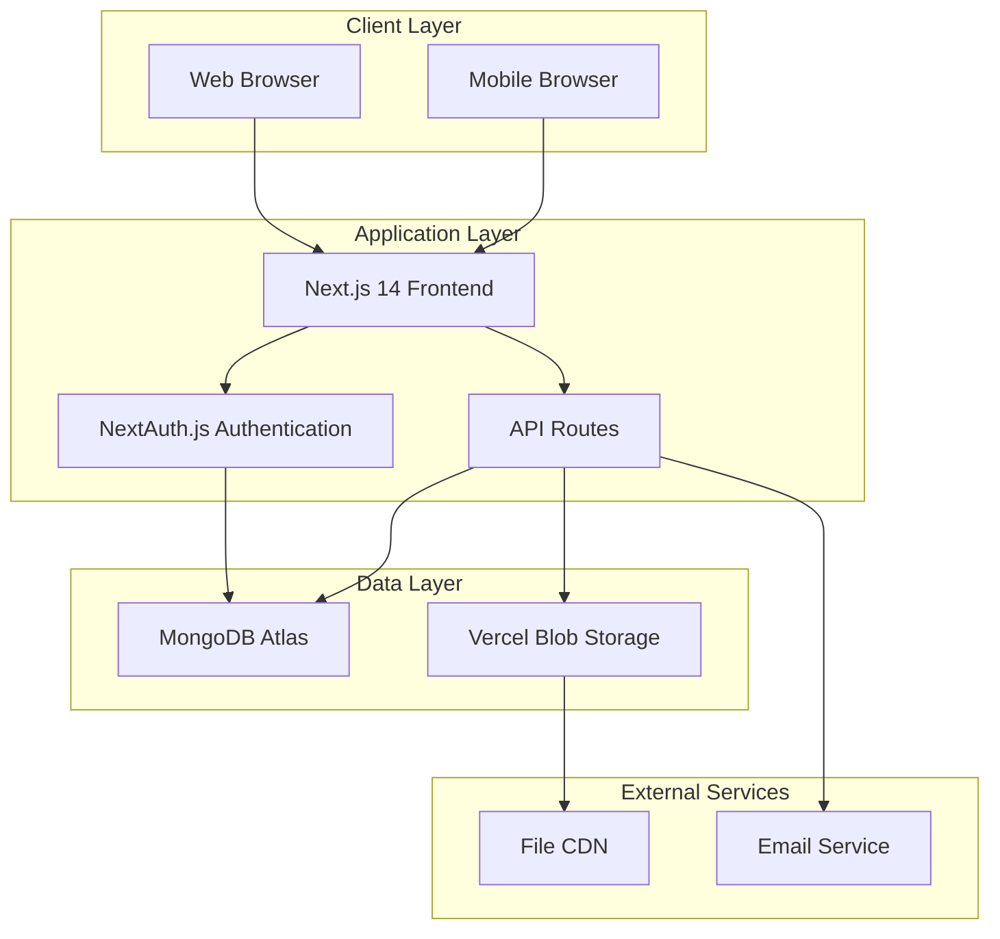

# Design Document

## Overview

The Infinity Weekends Training Website is built as a modern web application using Next.js 14 with TypeScript, providing a secure, scalable platform for travel agency training and business operations. The system implements a role-based architecture with distinct user types (agents and admins) and comprehensive content management capabilities.

The application follows a three-tier architecture pattern with a React-based frontend, Next.js API routes for backend logic, and MongoDB for data persistence. Authentication and session management are handled through NextAuth.js, ensuring secure access control throughout the platform.

## Architecture

### System Architecture



### Technology Stack

- **Frontend**: Next.js 14 with App Router, TypeScript, Tailwind CSS
- **Authentication**: NextAuth.js with MongoDB session strategy
- **Database**: MongoDB Atlas with Mongoose ODM
- **File Storage**: Vercel Blob for media and document storage
- **Email**: Nodemailer with SMTP configuration
- **Deployment**: Vercel with environment-based configuration
- **Validation**: Zod for schema validation, React Hook Form for form handling

### Security Architecture

The system implements multiple layers of security:
- HTTPS enforcement across all communications
- JWT-based session management with secure cookies
- Role-based access control (RBAC) with middleware protection
- Input validation and sanitization at API boundaries
- File upload security with type and size validation
- Rate limiting on authentication and form submission endpoints

## Components and Interfaces

### Core Components Structure

```
/components/
├── auth/
│   ├── RegisterForm.tsx          # User registration interface
│   ├── LoginForm.tsx             # Authentication interface
│   └── ProtectedRoute.tsx        # Route protection wrapper
├── admin/
│   ├── ApprovalDashboard.tsx     # User approval management
│   ├── OffersManager.tsx         # Offers CRUD interface
│   ├── EnquiriesManager.tsx      # Inquiry management
│   └── TrainingManager.tsx       # Training content management
├── offers/
│   ├── OffersList.tsx            # Public offers display
│   ├── OfferCard.tsx             # Individual offer component
│   └── OfferDetails.tsx          # Detailed offer view
├── enquiries/
│   ├── EnquiryForm.tsx           # Inquiry submission form
│   └── EnquiryConfirmation.tsx   # Submission confirmation
├── training/
│   ├── TrainingList.tsx          # Training materials listing
│   ├── VideoPlayer.tsx           # Video content player
│   ├── BlogReader.tsx            # Blog article display
│   └── DownloadManager.tsx       # File download interface
├── contact/
│   ├── ContactInfo.tsx           # Contact information display
│   └── ContactForm.tsx           # General contact form
└── shared/
    ├── Layout.tsx                # Main application layout
    ├── Navigation.tsx            # Navigation component
    ├── LoadingSpinner.tsx        # Loading states
    └── ErrorBoundary.tsx         # Error handling
```

### API Interface Design

```typescript
// Authentication APIs
POST /api/auth/register
POST /api/auth/login
POST /api/auth/logout

// User Management APIs
GET /api/admin/users/pending
POST /api/admin/users/approve
POST /api/admin/users/reject
GET /api/admin/users
PUT /api/admin/users/[id]

// Offers APIs
GET /api/offers
POST /api/admin/offers
PUT /api/admin/offers/[id]
DELETE /api/admin/offers/[id]

// Enquiries APIs
POST /api/enquiries
GET /api/admin/enquiries
PUT /api/admin/enquiries/[id]

// Training Materials APIs
GET /api/training
POST /api/admin/training
PUT /api/admin/training/[id]
DELETE /api/admin/training/[id]
POST /api/admin/training/upload

// Contact APIs
GET /api/contact
PUT /api/admin/contact
```

### State Management Strategy

The application uses a combination of:
- **Server State**: React Query (TanStack Query) for API data caching and synchronization
- **Client State**: React useState and useContext for component-level state
- **Form State**: React Hook Form for form management and validation
- **Authentication State**: NextAuth.js session management with custom hooks

## Data Models

### User Model
```typescript
interface User {
  _id: ObjectId;
  name: string;
  companyName: string;
  abtaPtsNumber: string;
  contactEmail: string;
  websiteAddress: string;
  isApproved: boolean;
  role: 'agent' | 'admin';
  createdAt: Date;
  updatedAt: Date;
  approvedBy?: ObjectId;
  approvedAt?: Date;
}
```

### Offer Model
```typescript
interface Offer {
  _id: ObjectId;
  title: string;
  description: string;
  inclusions: string[];
  isActive: boolean;
  createdAt: Date;
  updatedAt: Date;
  createdBy: ObjectId;
}
```

### Enquiry Model
```typescript
interface Enquiry {
  _id: ObjectId;
  leadName: string;
  tripType: 'stag' | 'hen' | 'other';
  agentEmail: string;
  resort: string;
  travelDate: Date;
  departureAirport: string;
  numberOfNights: number;
  numberOfGuests: number;
  eventsRequested: string[];
  accommodationType: 'hotel' | 'apartments';
  boardType: string;
  budgetPerPerson: number;
  status: 'new' | 'in-progress' | 'completed';
  createdAt: Date;
  updatedAt: Date;
  submittedBy: ObjectId;
}
```

### Training Material Model
```typescript
interface TrainingMaterial {
  _id: ObjectId;
  title: string;
  description: string;
  type: 'video' | 'blog' | 'download';
  contentUrl?: string;
  fileUrl?: string;
  isActive: boolean;
  createdAt: Date;
  updatedAt: Date;
  createdBy: ObjectId;
}
```

### Contact Information Model
```typescript
interface ContactInfo {
  _id: ObjectId;
  generalEnquiriesPhone: string;
  emergencyPhone: string;
  email: string;
  website: string;
  socialMediaLinks: {
    facebook?: string;
    instagram?: string;
    twitter?: string;
    linkedin?: string;
  };
  updatedAt: Date;
  updatedBy: ObjectId;
}
```

## Error Handling

### Error Handling Strategy

The application implements comprehensive error handling across multiple layers:

#### Frontend Error Handling
- **React Error Boundaries**: Catch and display component-level errors
- **Form Validation**: Real-time validation with user-friendly error messages
- **API Error Handling**: Centralized error handling for API responses
- **Loading States**: Clear loading indicators during async operations

#### Backend Error Handling
- **Input Validation**: Zod schema validation for all API inputs
- **Database Errors**: Mongoose error handling with user-friendly messages
- **Authentication Errors**: Proper error responses for auth failures
- **File Upload Errors**: Validation and error handling for file operations

#### Error Response Format
```typescript
interface ErrorResponse {
  success: false;
  error: {
    code: string;
    message: string;
    details?: any;
  };
  timestamp: string;
}
```

### Error Categories
1. **Validation Errors**: Input validation failures with field-specific messages
2. **Authentication Errors**: Login failures, session expiry, unauthorized access
3. **Authorization Errors**: Insufficient permissions for requested operations
4. **Database Errors**: Connection issues, query failures, constraint violations
5. **File Upload Errors**: Invalid file types, size limits, upload failures
6. **Email Errors**: SMTP failures, invalid email addresses, delivery issues

## Testing Strategy

### Testing Pyramid

#### Unit Tests
- **Component Testing**: React Testing Library for component behavior
- **Utility Functions**: Jest for business logic and helper functions
- **API Route Testing**: Supertest for API endpoint functionality
- **Database Models**: Mongoose model validation and methods

#### Integration Tests
- **Authentication Flow**: Complete login/registration process testing
- **API Integration**: End-to-end API workflow testing
- **Database Operations**: CRUD operations with test database
- **Email Integration**: Mock email service testing

#### End-to-End Tests
- **User Journeys**: Playwright for complete user workflow testing
- **Admin Workflows**: Full admin approval and management processes
- **Cross-Browser Testing**: Chrome, Firefox, Safari compatibility
- **Mobile Responsiveness**: Touch interactions and responsive design

### Test Data Management
- **Test Database**: Separate MongoDB instance for testing
- **Fixtures**: Predefined test data for consistent testing
- **Mocking**: External service mocking for isolated testing
- **Cleanup**: Automated test data cleanup between test runs

### Performance Testing
- **Load Testing**: API endpoint performance under load
- **Database Performance**: Query optimization and indexing validation
- **Frontend Performance**: Bundle size and rendering performance
- **File Upload Performance**: Large file handling and timeout testing

## Implementation Considerations

### Database Optimization
- **Indexing Strategy**: Compound indexes on frequently queried fields
- **Connection Pooling**: Optimized MongoDB connection management
- **Query Optimization**: Efficient aggregation pipelines and projections
- **Data Archiving**: Strategy for managing historical data growth

### Performance Optimization
- **Code Splitting**: Dynamic imports for route-based code splitting
- **Image Optimization**: Next.js Image component with WebP support
- **Caching Strategy**: API response caching and static asset optimization
- **Bundle Optimization**: Tree shaking and dependency optimization

### Scalability Considerations
- **Horizontal Scaling**: Stateless API design for load balancer compatibility
- **CDN Integration**: Static asset delivery through Vercel Edge Network
- **Database Scaling**: MongoDB Atlas auto-scaling configuration
- **Monitoring**: Application performance monitoring and alerting

### Security Implementation
- **Input Sanitization**: XSS prevention through proper encoding
- **CSRF Protection**: Token-based CSRF protection for forms
- **Rate Limiting**: API endpoint protection against abuse
- **Audit Logging**: Comprehensive logging for security events